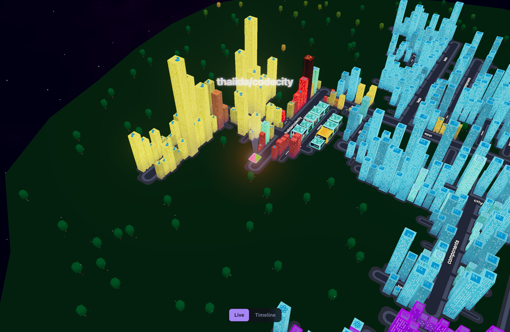
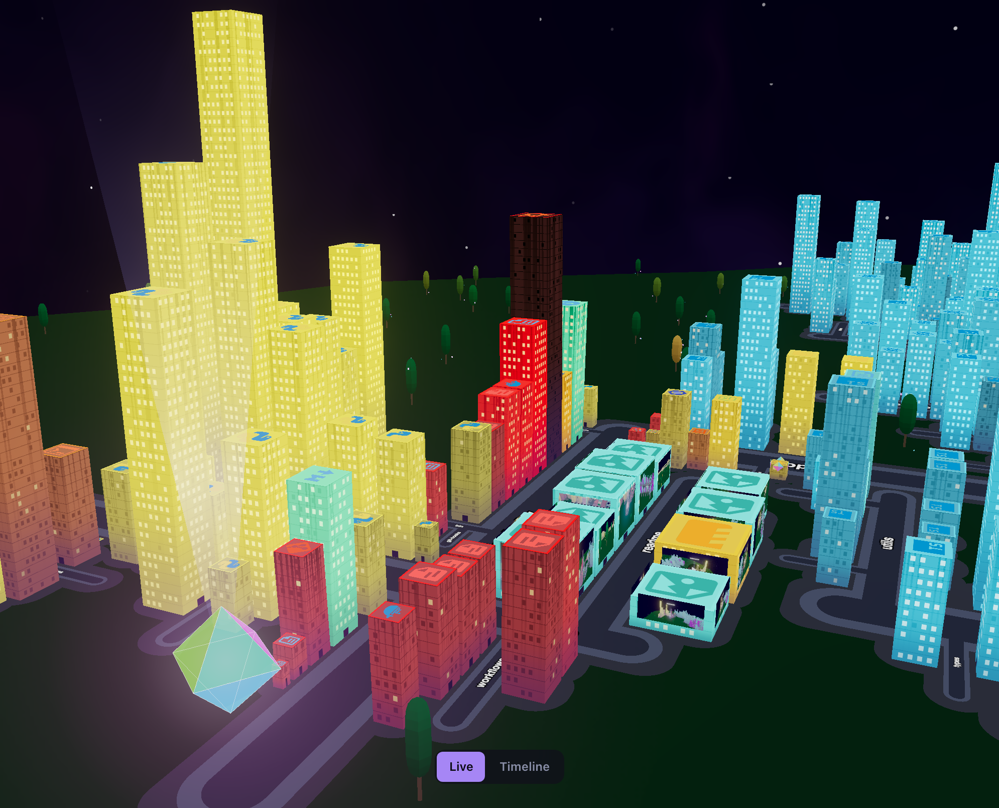
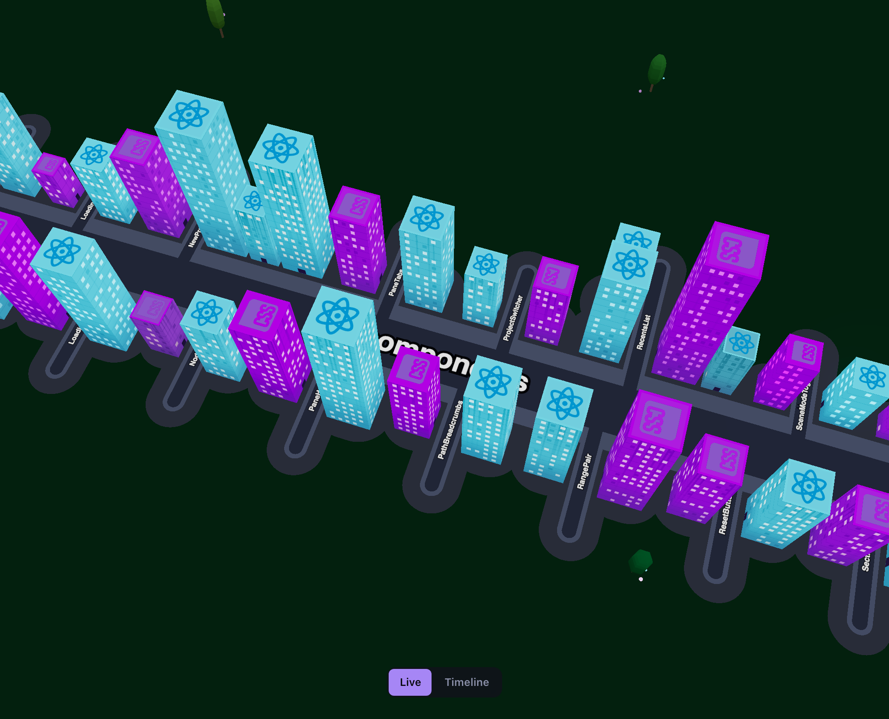
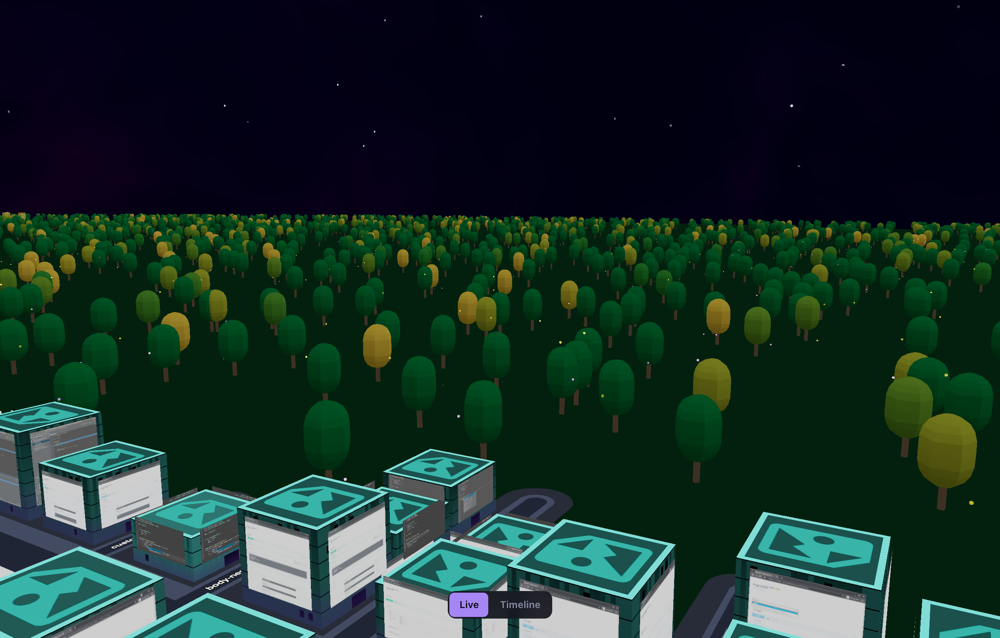
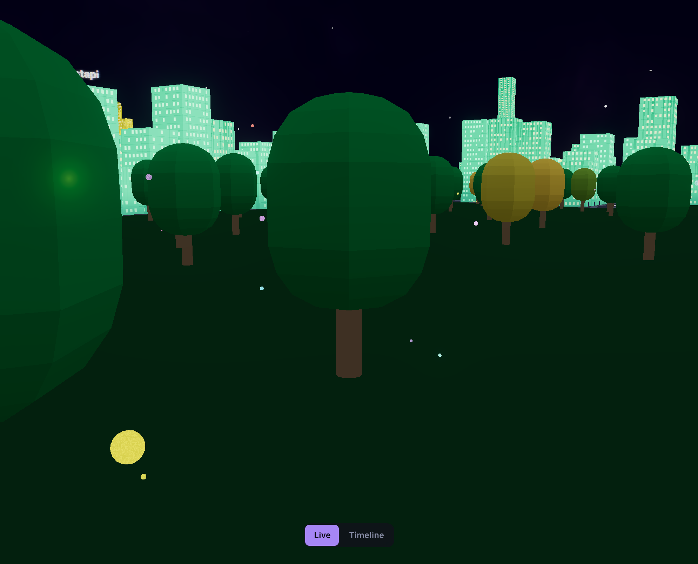
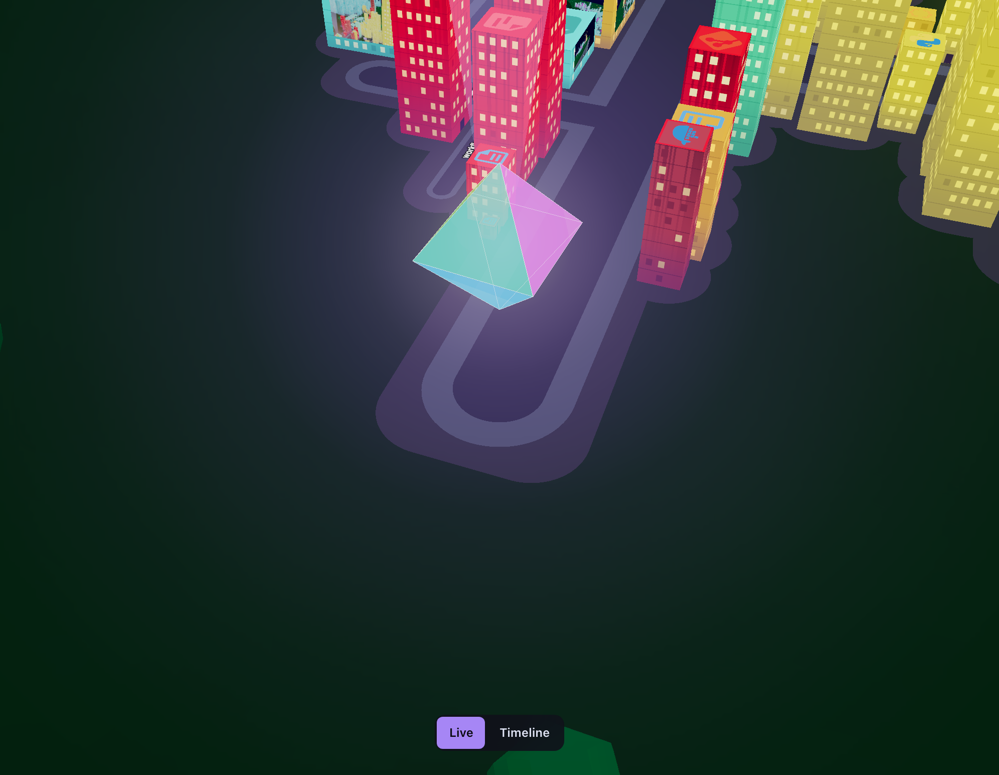
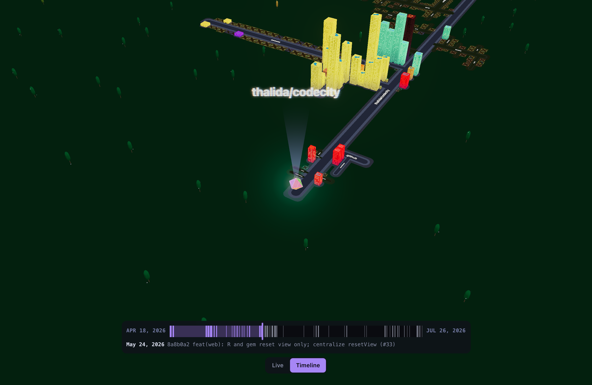

<div align="center">
  <h1>
     codecity
  </h1>
  <p><a href="https://codecity.io">codecity.io</a></p>
</div>

**codecity turns any git repo into a 3D city.** It walks the file tree and git history and builds a world: directories become streets, files become buildings, every commit grows a tree, and every author a firefly.


## Try it

**Open any public repo at [codecity.io](https://codecity.io).**

To view private and local repos, follow the steps below.

## Run it yourself

You need:

- [Docker](https://docs.docker.com/get-docker/)
  - macOS: Docker Desktop
  - Windows: Docker Desktop, or engine + WSL
  - Linux: `docker`
- A modern browser with WebGL2 (Chrome, Safari, Firefox, Edge)

```sh
docker run --rm --init --pull=always \
    -v codecity-cache:/cache \
    -p 8080:8080 \
    ghcr.io/thalida/codecity
```

1. Open <http://localhost:8080/> to reach the Projects page
2. Enter a repo URL and pick a branch
3. Explore your city!

Local folders take one more step, see [Local directories](#local-directories) below.

**Tips**

- `--pull=always` keeps you on the latest image; drop it to pin to your cached copy
- Wipe the cache: `docker volume rm codecity-cache`
- Port in use? `-p 8081:8080`

## Advanced setup

### Local directories

Local repo support is **disabled by default**. To enable it, set `CODECITY_ALLOW_LOCAL_REPOS=1` *and* mount the directory read-only into the container at the same absolute path:

```sh
docker run --rm --init --pull=always \
    -e CODECITY_ALLOW_LOCAL_REPOS=1 \
    -v "$HOME/Documents/Repos:$HOME/Documents/Repos:ro" \
    -v codecity-cache:/cache \
    -p 8080:8080 \
    ghcr.io/thalida/codecity
```

- Use multiple `-v` flags to mount more than one directory
- codecity only renders git working trees: `git init` first to render a non-git directory

### `.codecityignore`

For per-project ignores, drop a `.codecityignore` at the scan root, one pattern per line:

```gitignore
# Skip anywhere named "fixtures"
fixtures

# Skip a specific path (relative to scan root)
tests/fixtures/large-repo

# Un-ignore a default skip (! prefix overrides ALWAYS_SKIP)
!package-lock.json
```

#### Skipped by default

Always ignored, even when tracked (`!` un-ignores them):

- VCS: `.git`, `.hg`, `.svn`
- JS: `node_modules`, `package-lock.json`, `yarn.lock`, `pnpm-lock.yaml`, `bun.lock`, `bun.lockb`, `deno.lock`
- Python: `.venv`, `venv`, `env`, `__pycache__`, `poetry.lock`, `uv.lock`, `Pipfile.lock`
- Rust: `target`, `.cargo`, `Cargo.lock`
- Go: `Gopkg.lock`, `go.sum`
- PHP: `composer.lock`
- Ruby: `Gemfile.lock`
- Elixir: `mix.lock`
- CocoaPods: `Podfile.lock`
- Nix: `flake.lock`
- Framework caches: `.next`, `.nuxt`, `.svelte-kit`
- Test / coverage: `.pytest_cache`, `.mypy_cache`, `.ruff_cache`, `.tox`, `.coverage`, `htmlcov`
- IDE / OS: `.idea`, `.vscode`, `.DS_Store`
- Generated artifacts: `sbom.json` (CycloneDX / SPDX software bill of materials)
- Vendored single-file amalgamations: `sqlite3.c`, `miniz.c`, `lua.c` (one giant `.c` blob inlining a whole library: 100k+ lines that would otherwise render as a single skyscraper distorting every height-based visual)

## Reading the city



Just about every aspect of the rendering is tunable in the Settings pane, opened via the gear in the left sidebar.

### Buildings: one per file



- **Height**: line count (sqrt-interp across the floor range)
- **Width & depth**: byte size (log-interp, square footprint)
- **Hue**: file extension
- **Saturation**: last-modified (recent → vivid)
- **Lightness**: last-modified (recent → bright)
- **Roof border**: the color the file would have if you touched it today, so the gap between the border and the faded walls is how far it has aged
- **Windows**: lit-pane density, plus a glow that tracks how recently the file was created (newer files glow brighter)
- **Aging**: older files get grime streaks and a slight lean
- **Media files** (images, video) render an ad-panel face on the front above the door
- **Binary files** (databases, `.wasm`, `.so`, fonts, audio) become windowless data blocks sized by byte count, faced with a fingerprint of their own bytes — or, for fonts and audio, a letter set in the font and the waveform itself

### Streets: one per directory



- **Width tier**: descendant count (step function)
- **Length**: packed siblings + spacing
- **Label**: directory name painted on the asphalt

### Trees: one per commit



- **Placement**: oldest commit closest to the gem, newest at the edges
- **Height**: commit age (older = taller)
- **Canopy width**: files changed in that commit
- **Color**: commits-per-day (solo-day vs busy-day color blend)

### Fireflies: one orb per author on each commit



- **Color**: per author. Each committer gets their own hue
- **Scale**: that author's total commit count
- **Co-authored commits**: `Co-authored-by:` trailers parsed out of the commit message. Each distinct contributor on a commit gets their own firefly orbiting that tree, in their own color

### Gem: the root beacon



- **Root marker**: floats above the root street
- **Click**: clears the selection and resets the view

## Timeline



**Scrub the whole history and watch the city grow.** The scene toggle flips from Live to Timeline, and a dated slider spans the repo, a tick per commit. Drag it and the city rebuilds at that commit.

Files that don't exist at that commit still get a place, set in the World tab under Timeline:

- **Deleted files** keep their plot and get crossed out, so a folder that's since been emptied still shows what it used to hold.
- **Future files** mark where a not-yet-created file will land with an ultra-low slab, tinted toward its own color. Off by default; turn it on to see the shape the city is growing toward.

## How it works

1. **Clone or read:** Remote repos clone into a local cache (current tree only); local folders are read in place.
2. **Scan:** codecity reads only git-tracked files (`git ls-files`), honoring `.codecityignore` and the default skips, and records each file's created and last-modified dates plus each commit's files, authors, and date.
3. **Stream:** Packed into one manifest and streamed to the browser as it's computed: a skeleton city renders first as a placeholder, then fills in with the full scan.
4. **Layout:** An off-main-thread pass packs the streets so nothing overlaps: directories become streets, files line up as buildings, subdirectories branch off at right angles.
5. **Build:** Each building is sized from its file (height = lines, footprint = bytes), one tree per commit (oldest nearest the gem), a firefly per author.
6. **Render:** Drawn with three.js (WebGL).

## Development

### Setup

You need:

- [Docker](https://docs.docker.com/get-docker/)
- [just](https://github.com/casey/just#installation)
- [python3](https://www.python.org/downloads/)
- [uv](https://docs.astral.sh/uv/) (for `just fmt` and `just gen-types`)

```sh
git clone https://github.com/thalida/codecity.git
cd codecity
just install-hooks   # one-time: pre-push hooks (lint + prettier + tests)
```

The pre-push hook runs the full lint + tests before pushing; bypass with `git push --no-verify` (Docker must be running).

### Commands

| Command | What it does |
| --- | --- |
| `just dev` | Vite HMR + API auto-reload at `http://<slug>.localhost:<port>/` |
| `just test` | pytest + vitest in containers |
| `just lint` | ruff, eslint, prettier, and typecheck |
| `just fmt` | apply Python formatting (ruff) |
| `just gen-types` | regenerate the frontend wire types from the OpenAPI schema |
| `just build` | build the local Docker image |
| `just run` | run the local image like an end user |
| `just screenshots [names]` | regenerate the README screenshots |
| `just demo-video` | record the README `demo.mp4` |
| `just deploy` | redeploy production without cutting a release |
| `just clean` | tear down this worktree's containers and volumes |

### Worktrees

- Each worktree gets its own `<slug>.localhost` URL, so source-picker recents stay isolated per project in localstorage
- `just dev` and `just run` take a path arg to mount a local repo (`just dev ~/Documents/Repos/myproj`), which also sets `CODECITY_ALLOW_LOCAL_REPOS=1`; without it, codecity is git-URL-only

### Backend

- [FastAPI](https://fastapi.tiangolo.com/) on uvicorn, single process by design (the in-memory scan-root trust set in `api/security.py` can't be split across workers)
- scan progress streams over Server-Sent Events (`GET /api/manifest`)
- API docs at `/api/docs` ([Scalar](https://github.com/scalar/scalar)); raw schema at `/api/openapi.json`

## Release

```sh
just release v0.2.0
```

`just release`:

- verifies you're on a clean `main` in sync with origin
- creates an annotated tag and pushes it

Pushing the tag triggers GitHub Actions, which:

- builds a multi-arch image (linux/amd64 + linux/arm64)
- pushes to `ghcr.io/thalida/codecity` with all tag aliases
- signs with cosign (keyless via OIDC)
- smoke-tests via `/api/health`
- creates a GitHub Release

### Deploy

A release deploys itself: after the image is published, the release workflow
dispatches the `deploy.yml` workflow on Forgejo with `app: app-codecity`. It
waits on the build, so the deploy never runs before the image exists, and it
no-ops with a notice when the deploy secrets aren't set.

To redeploy without cutting a release:

```sh
just setup      # seeds .local/deploy.env from deploy.env.example
just deploy     # or: just deploy app-other
```

Fill in host, repo and token in `.local/deploy.env`, which is gitignored. They
live there rather than in the tracked `.env` because this repo is public.

For the release workflow, the same three go in **Settings → Secrets and
variables → Actions → Secrets**: `FORGEJO_HOST`, `FORGEJO_REPO`,
`FORGEJO_TOKEN`. Secrets rather than variables, since only secrets are masked in
the public Actions logs. `FORGEJO_DEPLOY_APP` is the one non-sensitive knob and
lives in `.env`.

The token needs `repository → Read and Write` and nothing else.

### Verify signatures

```sh
cosign verify \
  --certificate-identity-regexp 'https://github.com/thalida/codecity/.*' \
  --certificate-oidc-issuer https://token.actions.githubusercontent.com \
  ghcr.io/thalida/codecity:v0.2.0
```

## License

[AGPL-3.0](LICENSE)
