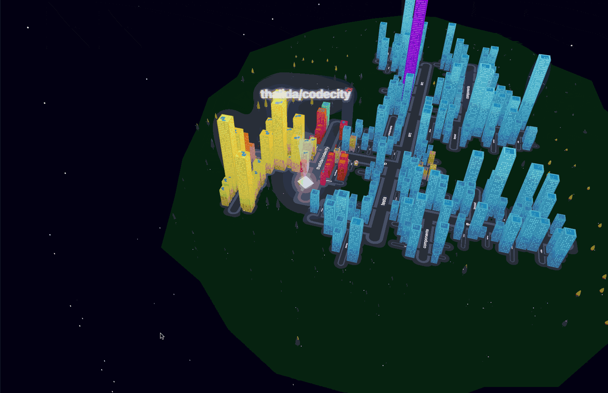

<div align="center">
  <h1>
     codecity
  </h1>
</div>

Turn any git repo into a living 3D city. codecity walks the tree, reads file and git history, and paints an isometric world in your browser: directories become streets, files rise into buildings, every commit grows a tree.



## Requirements

- [Docker](https://docs.docker.com/get-docker/) (Docker Desktop on macOS/Windows; engine + WSL on Windows; `docker` on Linux)
- A modern browser with WebGL2 (Chrome, Safari, Firefox, Edge)

## Quick start

```sh
docker run --rm --init --pull=always \
    -v codecity-cache:/cache \
    -p 8080:8080 \
    ghcr.io/thalida/codecity
```

Open <http://localhost:8080/> and paste a git URL into the source picker.

Tips:

- `--pull=always` keeps you on the latest image; drop it to pin to your cached copy.
- Wipe the cache: `docker volume rm codecity-cache`.
- Port in use? `-p 8081:8080`.

## Local directories

Local-repo support is **disabled by default**. To enable it, set `CODECITY_ALLOW_LOCAL_REPOS=1` *and* mount the directory read-only into the container at the same absolute path:

```sh
docker run --rm --init --pull=always \
    -e CODECITY_ALLOW_LOCAL_REPOS=1 \
    -v "$HOME/Documents/Repos:$HOME/Documents/Repos:ro" \
    -v codecity-cache:/cache \
    -p 8080:8080 \
    ghcr.io/thalida/codecity
```

Use multiple `-v` flags for multiple directories. codecity only renders git working trees: `git init` first if you want to render a non-git directory.

## Controls

| Input | Action |
|-------|--------|
| `R` | Reset the camera view |
| `F` | Focus camera on the current selection |
| `Esc` | Clear selection |
| Click | Select building / street / gem |
| Double-click | Focus camera on the target |
| Left drag | Orbit |
| Right drag | Pan |
| Middle drag | Dolly (zoom) |
| Scroll | Zoom toward cursor |

## What gets rendered


### Buildings: one per file


- **Height**: line count (sqrt-interp across the floor range).
- **Width & depth**: byte size (log-interp, square footprint).
- **Hue**: file extension.
- **Saturation**: last-modified (recent → vivid).
- **Lightness**: last-modified (recent → bright).
- **Windows**: lit-pane density and glow track recency. Newer files glow brighter.
- **Aging**: older files get grime streaks and a slight lean.
- **Media files** (images, video) render an ad-panel face on the front above the door.

### Streets: one per directory


- **Width tier**: descendant count (step function).
- **Length**: packed siblings + spacing.
- **Label**: directory name painted on the asphalt.

### Trees: one per commit


- **Placement**: oldest commit closest to the gem, newest at the edges.
- **Height**: commit age (older = taller).
- **Canopy width + facet detail**: files changed in that commit.
- **Color**: commits-per-day (solo-day vs busy-day color blend).
- Age desaturation (optional) fades the oldest commits toward gray.

### Fireflies: one orb per author on each commit


- **Color**: per author. Each committer gets their own hue.
- **Scale**: that author's total commit count.
- **Co-authored commits**: `Co-authored-by:` trailers parsed out of the commit message — each distinct contributor on a commit gets their own firefly orbiting that tree, in their own color.

### Gem: the root beacon


Floats above the root street's origin-end cap. Size scales with the root street's width.

## Scanning

codecity scans only **git-tracked** files (`git ls-files`). Gitignored and untracked paths are hidden automatically. Per-file git history (created + most-recent-modify dates) and per-commit metadata (file count, authors, date) feed the visuals above.

Some directories and files are always skipped, even when tracked:

- VCS: `.git`, `.hg`, `.svn`
- JS: `node_modules`, `package-lock.json`, `yarn.lock`, `pnpm-lock.yaml`, `bun.lock`, `bun.lockb`, `deno.lock`
- Python: `.venv`, `venv`, `env`, `__pycache__`, `poetry.lock`, `uv.lock`, `Pipfile.lock`
- Rust: `target`, `.cargo`, `Cargo.lock`
- Go: `Gopkg.lock`, `go.sum`
- PHP: `composer.lock`
- Ruby: `Gemfile.lock`
- Elixir: `mix.lock`
- CocoaPods: `Podfile.lock`
- Nix: `flake.lock`
- Framework caches: `.next`, `.nuxt`, `.svelte-kit`
- Test / coverage: `.pytest_cache`, `.mypy_cache`, `.ruff_cache`, `.tox`, `.coverage`, `htmlcov`
- IDE / OS: `.idea`, `.vscode`, `.DS_Store`
- Vendored single-file amalgamations: `sqlite3.c`, `miniz.c`, `lua.c` (one giant `.c` blob inlining a whole library: 100k+ lines that would otherwise render as a single skyscraper distorting every height-based visual)

### `.codecityignore`

Drop a `.codecityignore` file at the scan root for per-project ignores. One pattern per line.

```gitignore
# Skip anywhere named "fixtures"
fixtures

# Skip a specific path (relative to scan root)
tests/fixtures/large-repo

# Un-ignore a default skip (! prefix overrides ALWAYS_SKIP)
!package-lock.json
```

- No `/` → matches a name anywhere in the tree.
- Has `/` → anchored to the scan root.
- `!` prefix un-ignores either form (`!name` or `!path/to/thing`). `!.git` is silently rejected; the object database is never walked.

## Settings

Click the gear in the left sidebar to open the Settings pane. Tweaks stage as drafts; click Save to apply.

What you can tune:

- **Live updates**: off by default. Turn on to re-render the city when files change on disk; poll interval is configurable (1–60 s).
- **Buildings**: floor and width ranges, per-extension hue map, palette ranges, facade detail, aging, and the selection-fade cascade that dims unrelated buildings when one is selected.
- **Streets**: width tiers, spacing, colors, label typography.
- **Trees**: density falloff, height/width ranges, color encoding, age desaturation, facet detail.
- **Fireflies**: visibility, scale range, motion, orbit ring.
- **Scene**: sky color and stars.
- **Gem**: sizing and materials.
- **File preview**: syntax highlight theme.

## Development

You need [Docker](https://docs.docker.com/get-docker/), [just](https://github.com/casey/just#installation), and [python3](https://www.python.org/downloads/).

```sh
git clone https://github.com/thalida/codecity.git
cd codecity
just install-hooks   # pre-push: lint + prettier + tests
just dev             # http://<worktree-slug>.localhost:<port>/
just test            # pytest + vitest in containers
just build           # build the local image
just run             # run the local image like an end user
```

`just dev` and `just run` accept a path arg to mount a local repo: `just dev ~/Documents/Repos/myproj`. The path arg also sets `CODECITY_ALLOW_LOCAL_REPOS=1` for you (see [Local directories](#local-directories)). Without an arg, codecity is git-URL-only.

Each worktree gets its own `<slug>.localhost` URL so source-picker recents stay isolated per project in localStorage.

The pre-push hook runs pytest, vitest, eslint, prettier, and typecheck before pushing to origin. Bypass with `git push --no-verify` if needed. Docker must be running.

## Release

```sh
just release v0.2.0
```

`just release` verifies you're on a clean `main` in sync with origin, creates an annotated tag, and pushes it. GitHub Actions then builds a multi-arch image (linux/amd64 + linux/arm64), pushes to `ghcr.io/thalida/codecity` with all tag aliases, signs with cosign keyless via OIDC, smoke-tests via `/api/health`, and creates a GitHub Release.

Verify image signatures:

```sh
cosign verify \
  --certificate-identity-regexp 'https://github.com/thalida/codecity/.*' \
  --certificate-oidc-issuer https://token.actions.githubusercontent.com \
  ghcr.io/thalida/codecity:v0.2.0
```

## License

[AGPL-3.0](LICENSE)
